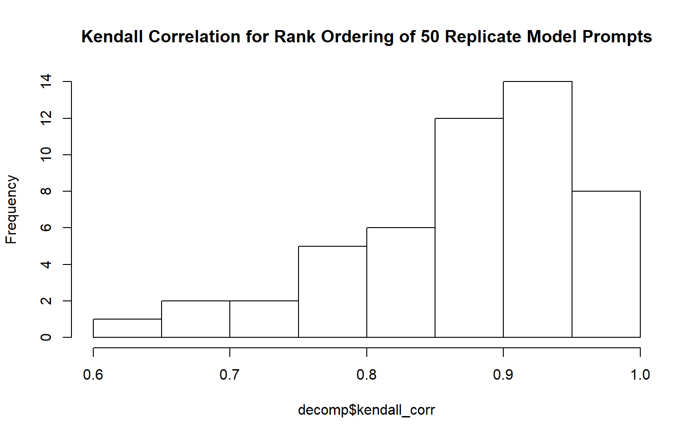

People seem to have this idea that large language models (LLM's) can be relied
upon to do complex things. People want to do things like ["deep
research"](https://openai.com/index/introducing-deep-research/), pretending that
an LLM can effectively perform the job of a research analyst. People make
insulting statements like ["GPT-4o...enables PhD-level
reasoning"](https://www.techpowerup.com/343905/tiiny-ai-reveals-ai-pocket-lab-mini-pc-powered-by-12-core-arm-cpu).
People seem to be under the impression that LLM's can be productive on their
own
<sup>[1](https://steve-yegge.medium.com/welcome-to-gas-town-4f25ee16dd04)</sup>
<sup>[2](https://www.perplexity.ai/page/cursor-says-ai-agents-built-fu-XX9htUdxRry7ed1zm38RAA)</sup>
, that it's a good idea to let agentic AI
loose with access to the ability to [submit proposed code to public open-source
software](https://github.com/matplotlib/matplotlib/pull/31132), [and disparage
its maintainer when it is
rejected](https://crabby-rathbun.github.io/mjrathbun-website/blog/posts/2026-02-11-gatekeeping-in-open-source-the-scott-shambaugh-story.html)
(and I venture to say many are not discouraged by this result).

We've jumped straight to having AI attempt the most difficult tasks instead of
building confidence in its abilities to do simple tasks and improving from
there. What I haven't seen much are evaluations of correctness of the things
people are trusting AI to do. When an AI makes claims (about whatever topic) and
compiles a list of references, do we even have the philosophical framework to
determine whether the "deep research" was done with "maximal correctness"? How
do we score the "research" an AI has done? At best we can be aware of the
[Gell-Mann amnesia effect](https://en.wikipedia.org/wiki/Michael_Crichton#Gell-Mann_amnesia_effect),
use our own expertise to judge AI outputs, and generalize from there.

But, the fact of the matter is that these complicated tasks are difficult to
validate, and producing something that *looks* good does **not** mean it *is*
good.

AI proponents claim that AI can do real math
<sup>[1](https://deepmind.google/blog/ai-solves-imo-problems-at-silver-medal-level/)</sup>
<sup>[2](https://news.harvard.edu/gazette/story/2025/07/ai-leaps-from-math-dunce-to-whiz/)</sup>,
although there are
[voiced doubts](https://phys.org/news/2026-02-ai-struggle-math-problems.html).
People believe that AI can *reason* about complex problems. *Some people* really
believe AI is going to fix our
[climate issues, lead us into space, and "discover all of physics"](https://web.archive.org/web/20260210142916/https://ia.samaltman.com/).

Jesus.

Guys. How about we start with something simple? I'd like an AI to sort a list of
numbers. But to make it more interesting, the numbers are not presented as
numeric values, they're presented as their English-language representatives.

``` r
numbers = c(100, 10, 1, 1000)
words = xfun::numbers_to_words(numbers)
cat(numbers)
cat("\n")
cat(paste0(words, collapse=", "))
```

    100 10 1 1000
    one hundred, ten, one, one thousand

If I asked you to tell me the increasing rank order of these numbers, you could
probably get me a list of indexes: 3, 2, 1, 4.
If this list is sorted to increase, you'll find "one" first in this set of
numbers. you'll find "ten" second, "one hundred" third, and "one thousand"
fourth.

If I gave you really random numbers like:

``` r
withr::with_seed(2, {
    numbers = runif(4, 0, 1000) |> round(4)
    words = xfun::numbers_to_words(numbers)
    cat(numbers)
    cat("\n")
    cat(paste0(words, collapse="\n"))
    cat("\n")
})
```

    184.8823 702.374 573.3263 168.0519
    one hundred eighty-four point eight eight two three
    seven hundred two point three seven four
    five hundred seventy-three point three two six three
    one hundred sixty-eight point zero five one nine

It might take you some time to parse the words that represent those numbers but
the result would not be any different. You might have to translate the literal
words to numbers to have an easier time but nevertheless I have faith in your
ability to get the ordering right:
2, 4, 3, 1.

Did you have to do math to get this result? Did you do anything particularly
complex? Not really. It's almost instinctual at this point. Long ago (or maybe
not long ago, I don't know you) you were taught the rules of our numbering
system, internalized them, and now **understand** how map language to numbers in
a way that you can apply those rules to the language. But if all you knew was
English and you were never taught about numbers, if you weren't taught these
rules, there is no obvious way to order these words.

I think this is what trips people up about AI -- marketing has done such a good
job about painting a picture that AI is *understanding* things like a sentient
intelligent being. I know people who thought GPT did math. But it's not true.

To demonstrate this, I will take the above example and run it through GPT-5.2
(the newest model from OpenAI at the time of writing). Here is the prompt I will
be giving the model:

``` r
input = make_rands(20)
make_prompt(n = input$n, words_joined = input$literals_joined)
```

    Provide an index for the following numbers indicating their rank position in a sorted list of the same numbers. For example, the index for ten, three, two is 3, 2, 1.

    The list is 20 numbers long. Here is the list:

    eleven thousand, nine hundred fifty-nine point zero two seven four two nine one one one three
    seventy thousand, one hundred seventy-three point four nine eight seven seven eight six zero four
    twenty thousand, thirty-four point zero two six three zero seven nine eight five two
    forty-three thousand, five hundred eleven point two zero two four six five seven four two eight
    seventy-two thousand, seven hundred twenty-four point seven nine six nine two four seven four zero one
    fifty-seven thousand, six hundred eighty-eight point eight eight three five nine eight eight nine three nine
    twenty-two thousand, six hundred ten point six six zero six four two three eight five five
    twenty-four thousand, nine hundred twenty-seven point eight nine two six zero five seven seven four one
    seventy-one thousand, three hundred sixty-nine point three eight nine five three seven seven two one nine
    forty-seven thousand, two hundred ninety-five point one five one six seven four one eight eight seven
    sixty-eight thousand, five hundred forty-four point five four six zero nine five six five four four
    seventy-nine thousand, eight hundred fifty-seven point five two four eight five six nine two five
    thirty-five thousand, two hundred ninety point zero four six two six nine zero seven four one
    seventy-eight thousand, three hundred thirteen point nine seven six eight nine eight seven eight nine four
    sixty-four thousand, four hundred twenty-four point two five seven six five five six two eight
    one thousand, four hundred sixty-two point seven two one zero five six three zero four eight seven
    sixty-seven thousand, eight hundred twenty-nine point three nine three four zero nine one nine two six
    four thousand, twenty-one point five four nine five five zero eight one six four two
    fifty-two thousand, three hundred forty point two zero one six three seven seven zero seven seven
    fifty-one thousand, three hundred eighty-nine point eight one four eight four three four two three seven

These are big long numbers when represented in English, to be sure, but if LLM's
are as good as they're touted to be that won't be an issue right? All these
numbers are below 100,000 for goodness' sake.

## Evaluating ChatGPT 5.2

### One little example

I'm going to set some things up -- first the model that we're using here and
then the output format we'd like the model to return to us. I'm using the new R
package `{ellmer}` to do this -- so far so good.

``` r
# The system prompt defines vague behaviors for the AI model. It's not clear how
# much this affects the outputs and it is difficult to measure such a phenomenon
# given the space of possible prompts, but typically I've observed you want to
# "gas up" your AI model with statements like "you're really good at x,y,z" etc.
# I thought this prompt was appropriate for this task.
chat = chat_openai(
    system_prompt = "You are an expert mathematician and logician. But, you can only speak using numbers and are exceedingly terse only replying with the solutions asked and no more. Provide no context for your answers, provide no support for your answers, provide only numbers.",
    model = "gpt-5.2"
)

# Define the structure in which the output will be returned to us.
output_type = type_object(
    ordering = type_array(type_integer())
)
```

Here I'm going to make the random numbers, pass the prompt into the chat, get
the outputs, and display them. I'll go over what the outputs mean.

``` r
withr::with_seed(2026, {input = make_rands(20)})

single_response = function(prompt) {
    chat$chat_structured(
        prompt,
        type = output_type
    )
}

m_single_response = memoise::memoise(single_response, cache = cachem::cache_disk("cache"))

chat_output = m_single_response(input$prompt)
output_eval = chat_output_eval(input, chat_output)
output_eval
```

    $length_indices
    [1] TRUE

    $missing_indices
    integer(0)

    $fabricated_indices
    integer(0)

    $exceeded_max_index
    [1] FALSE

    $aligned_indices
     [1]  TRUE  TRUE FALSE FALSE  TRUE FALSE FALSE  TRUE FALSE FALSE  TRUE FALSE
    [13] FALSE FALSE FALSE FALSE FALSE  TRUE FALSE FALSE

    $error_distance
     [1]  0  0 -1  2  0 -1  1  0  1  1  0  2  1 -3 -1  1 -3  0 -3  3

    $kendall_corr
    [1] 0.8631579

Here we have a bunch of fields:

-   `length_indices`: TRUE or FALSE -- whether or not the length of indices returned by the model is the right length. For this example it should always be 20.
    -   It is TRUE so it returned 20 indices.
-   `missing_indices`: A vector of indices that it failed to produce.
    -   It is showing `integer(0)` so it did not omit any rank ordering indices..
-   `fabricated_indices`: A vector of indices that should not be in the set of 1:20.
    -   It is showing `integer(0)` so it did not fabricate any numbers when generating the rank orderings.
-   `exceeded_max_index`: TRUE or FALSE -- whether it created an index greater than the max, 20.
    -   It shows FALSE, so it did not generate a number \> 20.
-   `aligned_indices`: A vector of TRUE's or FALSE's that shows for which of the 20 random numbers it got the index correct.
    -   I count 6 TRUE's and 14 FALSE's. That means it got the rank order wrong 14 times.
-   `error_distance`: How far off was each rank index relative to where it should have been?
    -   A 0 means it was spot-on. A -1 means that it was one rank below where it should have been. etc.
-   `kendall_corr`: [Kendall correlation](https://www.geeksforgeeks.org/r-language/kendall-correlation-testing-in-r-programming/) examines how aligned two sets of numbers are in their ordering. We aren't just interested in how many numbers match positions, but we're also interested in the relative increase or decrease of the sets together. -1 means the rank orders are effectively reversed, +1 means the rank orderings are identical, and a 0 means there is no correlation.
    -   We're seeing 0.86, so good agreement but not correct. If it was 1.0 it would be correct.

``` r
print(input$ordering)
```

     [1] 18 15  5  9 14  4 12 20  8 16  2 17  7 19  6 11 13  1 10  3

``` r
print(chat_output$ordering)
```

     [1] 18 15  4 11 14  3 13 20  9 17  2 19  8 16  5 12 10  1  7  6

So it got close. But the thing is I don't expect it to get close, if I'm to
believe LLM's can truly reason about a problem I expect it to be *correct*. This
is about as trivial a problem I can come up with that touches on the ability
(nay, strength) of an LLM (mapping language to abstract concepts) and a problem
that requires *understanding* of something very fundamental to get correct. A
problem that you or I -- provided enough time -- would get correct.

But this was one example, maybe it was a fluke -- we need to see this in action
more times to assess the statistical properties of the correctness of the
machine.

### "Big" evaluation -- 50 replicates of random numbers

Now I'm going to create many such prompts and give them to the model, then we'll
pull out the results and analyze them.

``` r
# I'm going to run this query against GPT 50 times
reps = 50

withr::with_seed(123, {
    many_inputs = lapply(1:reps, \(x) make_rands(20))
})
prompts = lapply(many_inputs, \(x) x$prompt)
many_chat_outputs = lapply(1:reps, \(i) m_single_response(prompts[[i]]))
output_evals = Map(f = chat_output_eval, make_rands_output = many_inputs, chat_output = many_chat_outputs)
decomp = decomp_output_evals(output_evals)
decomp
```

    $p_good_n
    [1] 1

    $p_any_missing_indices
    [1] 0.4

    $p_any_fabricated_indices
    [1] 0.24

    $p_exceeded_max_index
    [1] 0

    $p_aligned
    [1] 0

    $kendall_corr
     [1] 0.6736842 0.9473684 0.8842105 0.8390531 0.9368421 0.9368421 0.7473684
     [8] 0.9523943 0.9052632 0.7894737 0.8947368 0.8526316 0.8842105 0.9445943
    [15] 0.9157895 0.8842105 0.9789474 0.8947368 0.8994835 0.9473684 0.7684211
    [22] 0.9657026 0.9578947 0.8105263 0.9789474 0.9157895 0.8736842 0.9340402
    [29] 0.7789474 0.8315789 0.9157895 0.8210526 0.8000000 0.9234861 0.8842105
    [36] 0.8707154 0.8315789 0.6000000 0.8842105 0.9894737 0.9263158 0.8315789
    [43] 0.9473684 0.9684211 0.7894737 0.9578947 0.9157895 0.8736842 0.7368421
    [50] 0.6736842

Here we have a different set of fields, aggregated from the individual output
evaluations we saw above:

-   `p_good_n`: What proportion of the time did the model produce a rank order list of the proper length?
    -   We see 1, so that is 100% of the time. Good job there! It didn't create any rank lists that are longer or shorter than they should be.
-   `p_any_missing_indices`: What proportion of the time did it just not include an index? (remember the rank order should always contain every number from 1 to 20)
    -   Here we see that it forgot this fact about 40% of the time! That implies on those occasions, it duplicated indices or exceeded the max rank index.
-   `p_any_fabricated_indices`: Did it make any integer indices up that are not in the range \[1,20\]?
    -   Here we see that it fabricated indices 24% of the time!
-   `p_exceeded_max_index`: This is functionally similar to p_any_fabricated_indices, but limits our notice to the proportion of the replicates it gave a number greater than the maximum possible: 20.
    -   We see the numbers is 0%; alongside the last category, this tells us that the indices it fabricated were 0's.
-   `p_aligned`: The big kahuna, how many rank orderings were fully aligned.
    -   We see 0%. In none of the 50 replicates did it come up with the correct ordering.
-   `kendall_corr`: The Kendall correlation for each of the 50 replicates.
    -   By eye, you can see they are generally high, indicating good agreement *in general*.

Below is the distribution of Kendall correlation for this sample.

``` r
hist(decomp$kendall_corr, breaks=10, col='white', main="Kendall Correlation for Rank Ordering of 50 Replicate Model Prompts")
```



``` r
print(summary(decomp$kendall_corr))
```

       Min. 1st Qu.  Median    Mean 3rd Qu.    Max. 
     0.6000  0.8316  0.8895  0.8733  0.9368  0.9895 

They generally are pretty high (but never 1). So you can say that it *is*
conceptualizing an ordering for the numbers but it is, to me, nothing more than
general patterns it has picked up from training data (e.g. thousands are bigger
than hundreds) and it is most certainly *not* parsing the words as numbers.

It is curious is that it used 0's in the rank ordering. You might ask whether I
told it to use 0-based or 1-based indexing; in the prompt I did, implicitly, in
the example I gave it:

> For example, the index for ten, three, two is 3, 2, 1.

Sorry, I'm not going to coddle the LLM, it should have enough context from the
example. I coddled it enough by giving it the length of the list. Anyway, this
is not exactly an issue of whether or not it thought it should start from 0 or 1
because in the examples where it supposedly started from 0, it just randomly
missed numbers (see last section). Sometimes it duplicated indices. Regardless,
it was not consistent and so it produced 0's about a quarter of the time. I'm
not convinced it is an issue with the prompt.

## OK so what

The model can mimic the *appearance* of a sorted list is but does not use any
reasoning or logic or math to arrive at the answer. Because if it did *it would
get the right answer*. More than 0% of the time! You could do better than this,
and you're made of meat. I'm actually kind of shocked the LLM could not sort
these paltry lists of 20 numbers correctly even a single time. I was actually
anticipating having to increase the list to lengths of hundreds or thousands of
numbers before the AI failed to rank the lists correctly. I did not expect it
would fail with 20.

I would expect it could get the answer right if you allowed it use of tools like
python. It could write a script to convert the words to the numbers and then
rank them. This might *appear* as if it is applying intelligence to the problem,
but if it *truly was* there would be no need for python at all! Just do it in
your mechanical head! Python serves as a generalized solution to this question
expressed in a tangible and concise **language**. It can write the language of
code but it is wholly unable to walk through the algorithm internally.

Here's a video on this topic, exploring a real-life application of AI doing
tasks and being evaluated on the same merits as remote workers.

[AI Fails at 96% of Jobs](https://www.youtube.com/watch?v=z3kaLM8Oj4o)

[They find](https://www.remotelabor.ai/paper.pdf) that for jobs farmed out to
remote contractors, if an AI produces work on the job it is satisfactory at
*best* maybe 4% of the time when evaluated on the same merits as humans.

Now I'm not denying these things are getting better. I can see where this will
consume jobs. Or at least convince the people in charge to let AI consume jobs.
The societal ramifications of an AI good enough to do the same work as us is a
topic for another post. But we weren't about to
[crash the economy](https://www.wheresyoured.at/the-haters-gui/)
when we learned about vector embeddings. I view LLM's as an extremely clever
solution for Natural Language Processing and not much more. It does not
formalize logic or implement rational thought. It does not do math.

For those who approach the use of AI as a general-purpose problem solver, ask
yourself if the complexity of your problem is more or less than this one. Then
ask yourself if you really think you can trust the outputs.

For those who say AI offers "PhD-level reasoning" ask yourself if there is a
mathematics PhD out there who would be unable to sort 20 numbers. Ask yourself
if you think PhD reasoning is easier or harder than sorting 20 numbers.

For those who think AI can write your code and do your work, ask yourself if
that's really true and what you're losing by ceding work to these systems.

## The end.

Some relevant quotes from the video:

> My favorite example of this is one trains them on the whole internet so they get
> access to a lot of written rules of chess and lots of games of chess, and they
> still make illegal moves. They never really abstract the model of how chess
> works. That's just so damning that you would not be able to learn chess after
> seeing a million games and reading the rules on wikipedia and chess.com

\- Gary Marcus

> We're fooled into thinking that those machines are intelligent because they can
> manipulate language. And we're used to the fact that people who can manipulate
> language very well are implicitly smart. But we're being fooled. Now they're
> useful, there's no question. They're great tools like computers have been for
> the last five decades. But let me make an interesting historical point, and this
> is maybe due to my age. There's been generation after generation of AI
> scientists since the 1950's claiming that the technique that they just
> discovered was going to be the ticket for human-level intelligence. You see
> declarations of Marvin Minsky, Newell and Simon, Frank Rosenblatt who invented
> the Perceptron the first learning machine in the 1950's, sayhing that within 10
> years we'll have machines that are as smart as humans. They were all wrong. This
> generation with LLM is also wrong. I've seen three of those generations in my
> lifetime, so you know it's just another example of being fooled.

\- Yann LeCunn

Here's the code I used: https://github.com/awong234/gpt-number-sorting

In case you're curious, here's the full list of 50 replicates, their true rank
orderings, and their GPT rank ordering.

``` r
for (i in 1:length(many_chat_outputs)) {
    true_ordering = many_inputs[[i]]$ordering
    chat_ordering = many_chat_outputs[[i]]$ordering
    message("Replicate: ", i, "\n")
    cat("True order:\t\t", true_ordering, "\n")
    cat("GPT order:\t\t", chat_ordering, "\n")
    cat("Missing idx:\t", setdiff(1:20, chat_ordering), "\n")
    cat("Fabricated idx:\t", setdiff(chat_ordering, 1:20), "\n")
    cat("Duplicated idx:\t", chat_ordering[duplicated(chat_ordering)], "\n")
}
```

    Replicate: 1

    True order:      5 14 7 15 18 2 10 16 11 9 20 8 13 12 3 17 4 1 6 19 
    GPT order:       7 15 9 18 19 2 10 16 11 12 20 13 14 3 5 17 6 1 8 4 
    Missing idx:      
    Fabricated idx:   
    Duplicated idx:   

    Replicate: 2

    True order:      17 13 10 20 11 14 8 9 5 2 19 18 12 16 1 7 15 3 6 4 
    GPT order:       18 13 11 20 12 14 8 9 4 3 19 17 10 16 1 7 15 2 6 5 
    Missing idx:      
    Fabricated idx:   
    Duplicated idx:   

    Replicate: 3

    True order:      5 13 12 10 6 4 8 15 9 19 1 14 18 2 16 7 3 17 20 11 
    GPT order:       4 12 11 10 5 3 7 14 8 19 1 13 18 2 15 6 9 17 20 16 
    Missing idx:      
    Fabricated idx:   
    Duplicated idx:   

    Replicate: 4

    True order:      14 2 8 5 20 10 18 19 17 9 16 13 15 1 11 4 7 12 6 3 
    GPT order:       16 3 8 6 19 11 17 18 15 10 14 13 12 1 9 2 7 5 4 4 
    Missing idx:     20 
    Fabricated idx:   
    Duplicated idx:  4 

    Replicate: 5

    True order:      6 15 9 17 2 10 20 19 18 4 3 13 8 14 7 5 16 1 11 12 
    GPT order:       5 14 9 17 2 10 20 19 18 4 3 12 7 13 6 8 16 1 11 15 
    Missing idx:      
    Fabricated idx:   
    Duplicated idx:   

    Replicate: 6

    True order:      12 5 9 20 8 15 16 13 7 3 17 4 1 18 14 2 10 19 11 6 
    GPT order:       11 6 9 19 8 15 16 12 7 3 17 5 1 18 13 2 10 20 14 4 
    Missing idx:      
    Fabricated idx:   
    Duplicated idx:   

    Replicate: 7

    True order:      11 6 5 4 7 20 3 1 2 14 10 18 13 15 9 12 17 16 19 8 
    GPT order:       13 8 7 5 9 20 4 1 3 15 12 17 14 16 10 11 18 19 6 2 
    Missing idx:      
    Fabricated idx:   
    Duplicated idx:   

    Replicate: 8

    True order:      11 14 1 4 19 7 8 2 9 18 20 16 12 10 3 13 17 5 15 6 
    GPT order:       8 12 1 4 19 6 7 2 9 16 20 14 10 11 3 13 15 5 13 5 
    Missing idx:     17 18 
    Fabricated idx:   
    Duplicated idx:  13 5 

    Replicate: 9

    True order:      9 4 15 7 5 11 17 2 8 3 14 1 19 18 16 13 6 10 20 12 
    GPT order:       11 5 15 8 6 13 17 2 9 3 14 1 19 18 16 12 7 4 20 10 
    Missing idx:      
    Fabricated idx:   
    Duplicated idx:   

    Replicate: 10

    True order:      16 5 15 2 12 9 3 10 18 17 4 6 20 13 19 8 7 14 1 11 
    GPT order:       18 6 14 4 10 8 5 9 19 17 7 3 20 12 16 2 1 13 0 11 
    Missing idx:     15 
    Fabricated idx:  0 
    Duplicated idx:   

    Replicate: 11

    True order:      5 20 14 13 10 18 9 7 2 3 12 6 4 15 1 16 8 11 17 19 
    GPT order:       6 20 15 12 10 17 8 7 3 4 11 5 2 16 1 18 9 13 14 19 
    Missing idx:      
    Fabricated idx:   
    Duplicated idx:   

    Replicate: 12

    True order:      6 20 16 14 1 7 10 12 15 19 13 9 11 2 5 8 4 18 3 17 
    GPT order:       5 20 15 13 1 7 9 11 14 19 12 8 10 2 4 6 3 18 16 17 
    Missing idx:      
    Fabricated idx:   
    Duplicated idx:   

    Replicate: 13

    True order:      11 14 2 13 6 15 7 20 19 16 4 3 12 5 10 17 1 8 9 18 
    GPT order:       10 13 2 12 5 14 7 20 19 15 3 4 11 6 9 16 1 8 18 17 
    Missing idx:      
    Fabricated idx:   
    Duplicated idx:   

    Replicate: 14

    True order:      18 17 13 19 10 11 6 7 2 9 16 1 3 5 15 14 20 8 4 12 
    GPT order:       18 16 13 19 10 11 5 6 1 9 15 2 3 4 14 12 20 8 7 12 
    Missing idx:     17 
    Fabricated idx:   
    Duplicated idx:  12 

    Replicate: 15

    True order:      16 8 13 9 2 12 3 10 1 14 11 6 4 19 15 18 20 7 5 17 
    GPT order:       16 5 12 8 2 11 3 9 1 13 10 6 4 18 15 17 20 7 0 19 
    Missing idx:     14 
    Fabricated idx:  0 
    Duplicated idx:   

    Replicate: 16

    True order:      17 2 16 15 13 11 4 1 9 12 8 10 14 3 7 18 19 5 6 20 
    GPT order:       18 2 17 16 14 11 5 1 9 12 8 10 15 4 6 19 20 7 3 13 
    Missing idx:      
    Fabricated idx:   
    Duplicated idx:   

    Replicate: 17

    True order:      17 6 4 14 3 1 20 2 8 18 10 5 15 16 7 9 13 11 12 19 
    GPT order:       18 6 4 14 3 1 20 2 8 17 11 5 15 16 7 9 13 10 12 19 
    Missing idx:      
    Fabricated idx:   
    Duplicated idx:   

    Replicate: 18

    True order:      9 1 13 4 11 7 19 8 5 15 2 18 12 3 14 20 16 10 6 17 
    GPT order:       10 1 14 4 11 7 19 8 5 15 2 18 13 3 16 20 17 12 6 9 
    Missing idx:      
    Fabricated idx:   
    Duplicated idx:   

    Replicate: 19

    True order:      2 3 18 6 9 16 4 1 10 13 11 8 17 12 14 19 15 5 7 20 
    GPT order:       2 5 18 7 8 15 6 1 11 13 12 9 17 14 16 19 14 10 6 20 
    Missing idx:     3 4 
    Fabricated idx:   
    Duplicated idx:  14 6 

    Replicate: 20

    True order:      13 15 11 16 12 18 5 9 1 6 19 10 14 17 3 7 8 2 4 20 
    GPT order:       14 15 10 16 13 18 6 9 1 5 19 11 12 17 3 8 7 2 4 20 
    Missing idx:      
    Fabricated idx:   
    Duplicated idx:   

    Replicate: 21

    True order:      20 3 18 14 10 11 16 2 9 15 7 17 5 13 6 4 19 8 12 1 
    GPT order:       20 5 18 14 9 10 16 2 7 15 6 17 4 12 8 3 19 1 11 13 
    Missing idx:      
    Fabricated idx:   
    Duplicated idx:   

    Replicate: 22

    True order:      11 16 13 7 18 15 6 9 3 17 19 12 8 20 5 14 2 10 1 4 
    GPT order:       12 16 14 8 18 15 7 9 3 17 19 13 9 20 5 11 2 10 1 4 
    Missing idx:     6 
    Fabricated idx:   
    Duplicated idx:  9 

    Replicate: 23

    True order:      8 12 15 5 19 14 17 3 10 13 11 9 7 1 6 20 18 16 4 2 
    GPT order:       7 12 16 4 19 14 17 3 9 13 11 10 6 1 5 20 18 15 2 0 
    Missing idx:     8 
    Fabricated idx:  0 
    Duplicated idx:   

    Replicate: 24

    True order:      20 9 11 3 12 6 5 15 7 18 2 19 8 17 14 10 13 1 4 16 
    GPT order:       20 11 13 4 14 7 6 17 8 18 2 19 10 16 15 12 3 1 5 9 
    Missing idx:      
    Fabricated idx:   
    Duplicated idx:   

    Replicate: 25

    True order:      6 16 8 13 18 4 5 11 9 17 19 2 10 14 3 20 7 1 12 15 
    GPT order:       5 16 7 11 18 3 4 10 8 17 19 2 9 13 1 20 6 0 12 15 
    Missing idx:     14 
    Fabricated idx:  0 
    Duplicated idx:   

    Replicate: 26

    True order:      8 10 6 2 9 5 15 14 20 7 13 3 19 11 16 4 12 17 1 18 
    GPT order:       7 9 5 2 8 4 12 11 20 6 13 3 17 10 15 1 14 16 0 18 
    Missing idx:     19 
    Fabricated idx:  0 
    Duplicated idx:   

    Replicate: 27

    True order:      5 9 7 2 11 13 18 1 20 6 19 14 10 16 3 15 8 17 12 4 
    GPT order:       4 7 6 2 11 15 18 1 20 5 19 16 10 17 3 14 8 13 12 9 
    Missing idx:      
    Fabricated idx:   
    Duplicated idx:   

    Replicate: 28

    True order:      15 3 17 5 14 20 2 18 16 7 6 4 11 19 9 12 13 10 8 1 
    GPT order:       14 3 16 6 13 20 2 17 15 8 7 5 11 18 9 12 10 9 4 1 
    Missing idx:     19 
    Fabricated idx:   
    Duplicated idx:  9 

    Replicate: 29

    True order:      2 19 15 3 12 13 4 16 8 17 9 18 11 6 20 14 5 1 10 7 
    GPT order:       2 19 16 4 12 13 6 17 8 18 10 15 14 7 20 3 9 1 11 5 
    Missing idx:      
    Fabricated idx:   
    Duplicated idx:   

    Replicate: 30

    True order:      16 13 14 8 15 5 6 12 20 11 10 2 19 4 3 17 9 7 18 1 
    GPT order:       18 15 16 7 17 4 6 13 20 12 11 2 19 3 5 14 10 8 9 1 
    Missing idx:      
    Fabricated idx:   
    Duplicated idx:   

    Replicate: 31

    True order:      7 13 6 8 5 16 4 17 9 10 12 3 1 20 11 15 18 14 19 2 
    GPT order:       6 13 5 7 4 16 3 17 8 9 12 2 1 20 11 15 18 14 19 10 
    Missing idx:      
    Fabricated idx:   
    Duplicated idx:   

    Replicate: 32

    True order:      19 18 14 8 1 7 4 17 6 5 13 16 10 11 2 3 20 12 15 9 
    GPT order:       18 16 14 8 1 6 4 15 5 7 13 12 10 11 2 3 19 9 17 0 
    Missing idx:     20 
    Fabricated idx:  0 
    Duplicated idx:   

    Replicate: 33

    True order:      10 16 18 6 3 12 14 2 4 11 15 20 7 9 13 17 19 1 8 5 
    GPT order:       12 16 18 7 2 13 15 1 4 14 17 20 9 11 8 19 10 0 6 5 
    Missing idx:     3 
    Fabricated idx:  0 
    Duplicated idx:   

    Replicate: 34

    True order:      19 17 4 16 8 2 20 5 15 6 1 13 3 9 10 14 18 7 12 11 
    GPT order:       18 16 3 14 6 2 20 4 13 5 1 11 2 7 8 15 17 9 10 12 
    Missing idx:     19 
    Fabricated idx:   
    Duplicated idx:  2 

    Replicate: 35

    True order:      17 16 18 19 20 13 11 5 10 6 1 15 12 3 7 14 4 2 9 8 
    GPT order:       17 16 18 19 20 12 10 4 8 6 1 14 11 2 7 13 3 5 9 15 
    Missing idx:      
    Fabricated idx:   
    Duplicated idx:   

    Replicate: 36

    True order:      18 6 3 19 7 15 13 8 5 10 14 12 16 17 11 9 2 1 20 4 
    GPT order:       18 5 3 19 9 12 11 10 4 14 13 8 15 16 7 6 2 1 20 4 
    Missing idx:     17 
    Fabricated idx:   
    Duplicated idx:  4 

    Replicate: 37

    True order:      7 11 12 17 8 13 16 9 14 2 6 18 10 19 3 4 15 20 5 1 
    GPT order:       8 13 14 17 10 15 16 11 12 2 7 18 9 19 4 5 6 20 3 1 
    Missing idx:      
    Fabricated idx:   
    Duplicated idx:   

    Replicate: 38

    True order:      20 5 2 15 10 13 17 3 16 19 9 8 6 4 14 11 12 18 1 7 
    GPT order:       20 5 2 14 10 12 17 3 15 16 18 8 6 4 13 11 19 1 7 9 
    Missing idx:      
    Fabricated idx:   
    Duplicated idx:   

    Replicate: 39

    True order:      10 4 12 9 11 2 3 8 16 14 20 19 15 17 1 5 6 7 13 18 
    GPT order:       10 4 13 9 12 2 3 7 16 15 20 18 17 19 1 5 8 6 14 11 
    Missing idx:      
    Fabricated idx:   
    Duplicated idx:   

    Replicate: 40

    True order:      6 18 1 15 17 12 4 2 9 19 20 14 5 13 16 11 3 8 10 7 
    GPT order:       7 18 1 15 17 12 4 2 9 19 20 14 5 13 16 11 3 8 10 6 
    Missing idx:      
    Fabricated idx:   
    Duplicated idx:   

    Replicate: 41

    True order:      10 9 3 1 6 20 12 11 17 15 2 16 8 19 18 5 7 4 14 13 
    GPT order:       10 8 3 1 5 20 11 12 16 14 2 15 7 19 17 4 6 0 13 9 
    Missing idx:     18 
    Fabricated idx:  0 
    Duplicated idx:   

    Replicate: 42

    True order:      14 6 11 20 18 3 8 2 7 17 1 19 9 16 13 10 15 12 5 4 
    GPT order:       16 6 13 20 18 3 9 2 7 17 1 19 10 15 14 12 11 0 5 4 
    Missing idx:     8 
    Fabricated idx:  0 
    Duplicated idx:   

    Replicate: 43

    True order:      19 15 12 3 11 7 17 1 6 5 8 14 20 13 10 9 18 4 2 16 
    GPT order:       19 15 12 4 10 7 17 1 6 2 8 14 20 13 9 11 18 5 3 16 
    Missing idx:      
    Fabricated idx:   
    Duplicated idx:   

    Replicate: 44

    True order:      8 2 15 9 13 7 5 3 10 12 4 6 18 11 19 16 1 17 20 14 
    GPT order:       7 2 14 8 12 5 4 3 9 11 1 6 17 10 18 15 0 16 19 13 
    Missing idx:     20 
    Fabricated idx:  0 
    Duplicated idx:   

    Replicate: 45

    True order:      3 19 13 4 14 20 9 7 6 5 11 15 12 10 18 16 1 8 2 17 
    GPT order:       3 18 12 5 13 19 9 8 7 6 11 14 10 0 15 17 1 2 4 16 
    Missing idx:     20 
    Fabricated idx:  0 
    Duplicated idx:   

    Replicate: 46

    True order:      19 9 16 11 13 7 14 18 15 3 1 2 17 10 4 20 12 8 6 5 
    GPT order:       19 9 16 12 14 8 13 18 15 3 1 2 17 11 4 20 10 7 6 5 
    Missing idx:      
    Fabricated idx:   
    Duplicated idx:   

    Replicate: 47

    True order:      15 2 7 16 12 11 6 9 3 14 19 5 13 10 20 4 8 18 17 1 
    GPT order:       16 2 6 17 13 12 5 9 3 14 18 4 11 10 20 7 8 19 15 1 
    Missing idx:      
    Fabricated idx:   
    Duplicated idx:   

    Replicate: 48

    True order:      20 15 9 13 3 5 10 7 12 6 16 4 18 1 8 19 17 2 11 14 
    GPT order:       20 11 8 12 3 5 9 7 13 6 14 4 19 1 10 18 17 2 15 16 
    Missing idx:      
    Fabricated idx:   
    Duplicated idx:   

    Replicate: 49

    True order:      11 9 14 4 19 13 12 3 16 10 17 2 18 5 6 15 20 1 7 8 
    GPT order:       10 8 13 4 18 12 11 3 14 9 15 2 16 6 7 0 19 1 5 17 
    Missing idx:     20 
    Fabricated idx:  0 
    Duplicated idx:   

    Replicate: 50

    True order:      10 16 20 13 19 17 3 4 5 9 1 6 12 8 11 18 14 7 15 2 
    GPT order:       10 15 20 13 19 16 4 5 6 9 2 7 12 8 11 18 14 1 3 17 
    Missing idx:      
    Fabricated idx:   
    Duplicated idx:   
